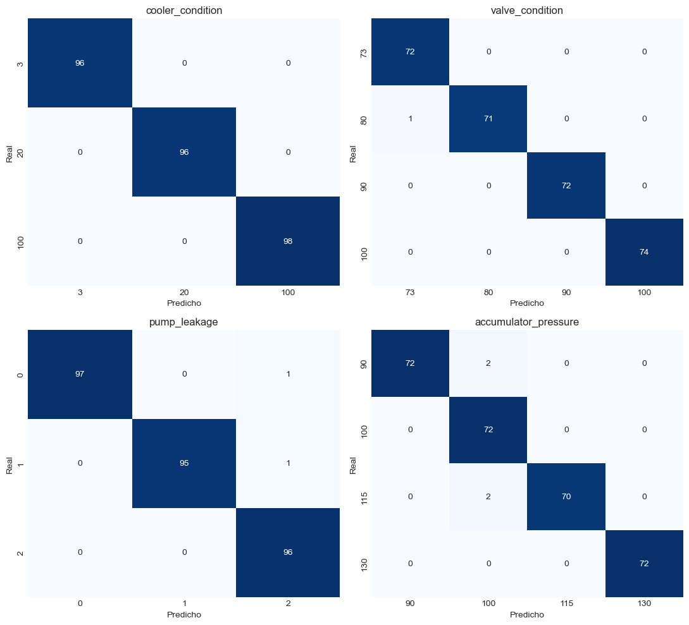

# Hydraulic Systems Predictive Maintenance · Mantenimiento Predictivo de Sistemas Hidráulicos

🇬🇧 [English](#english) · 🇪🇸 [Español](#español)



---

## English

End-to-end data science project on the **Condition Monitoring of Hydraulic Systems** dataset (UCI ID 447): from raw sensors to a continuous per-cycle health proxy, covering EDA, feature engineering, anomaly detection, per-component supervised classification, and the construction of a composite degradation index.

Each notebook follows the **Decision → Code → Interpretation** pattern: every code cell is preceded by a cell that justifies what is being done and why, and followed by a cell that interprets the actual results obtained on execution — not anticipated results. Every figure in this README is taken directly from running the notebooks (`jupyter nbconvert --execute`, 0 errors across all five).

### Executive summary

This project trains classifiers that flag degradation in 4 components of an industrial hydraulic system (cooler, valve, pump, accumulator) from sensor data alone — the kind of system found in manufacturing, construction, and heavy machinery. The best models correctly classify each component's degradation level between **84% and 100% of the time on data never seen during training** (see "Generalization to new operating points" in Phase 4 for why the honest answer is a range, not a single headline number). As an illustrative, unvalidated scenario: if even a modest share of unplanned downtime at a plant running this kind of equipment could be traced to these 4 failure modes, catching them earlier — instead of only after a breakdown — is exactly the use case this project demonstrates end to end, from raw sensor signal to a validated classifier. This public dataset has no cost data, so no real savings figure is claimed here; that number would have to come from a specific plant's maintenance records.

### The dataset

2,205 60-second cycles from a hydraulic test rig, with 17 sensor channels sampled at 100, 10, or 1 Hz (pressure, flow, temperature, power, efficiency, vibration) and 4 independent target variables describing the state of four physical components:

| Component | Variable | Levels |
|---|---|---|
| Cooler | `cooler_condition` | 3 (close to failure) / 20 (reduced) / 100 (optimal) |
| Valve | `valve_condition` | 73 / 80 / 90 / 100 (optimal) |
| Pump | `pump_leakage` | 0 (no leakage) / 1 / 2 (severe leakage) |
| Accumulator | `accumulator_pressure` | 90 / 100 / 115 / 130 (optimal) |

The four targets combine into a **144-cell factorial design** (3×4×3×4), crossed in a controlled way — this is not a degradation time series from a single machine, but independent laboratory experiments. This structural property shapes much of the project's methodological decisions (see Phase 3 and Limitations).

`ucimlrepo.fetch_ucirepo(id=447)` fails (`DatasetNotFoundError`) — the dataset is not enabled for programmatic import via that library despite being listed in the repository. [`src/data_loader.py`](src/data_loader.py) downloads the public static ZIP directly instead; see the module's docstring for the detail of that check.

### Project structure

```
hydraulic_maintenance/
├── data/
│   ├── raw/hydraulic_raw/          # raw sensors + profile.txt, downloaded by data_loader.py
│   └── processed/                  # intermediate and final artifacts per phase (see table below)
├── notebooks/
│   ├── 01_eda.ipynb
│   ├── 02_feature_engineering.ipynb
│   ├── 03_anomaly_detection.ipynb
│   ├── 04_failure_prediction.ipynb
│   └── 05_rul_proxy.ipynb
├── src/
│   ├── data_loader.py               # download and load the raw dataset
│   ├── feature_engineering.py       # extraction of the 73 features and selection by η²
│   ├── models.py                    # training/evaluation: detectors (Phase 3) and classifiers (Phase 4)
│   ├── validation.py                # Phase 4b: grouped generalization, dual-model bootstrap/McNemar,
│   │                                 # class_weight and hyperparameter-search checks (see Phase 4)
│   └── visualization.py             # the project's 9 figures, refactored as pure functions
├── run_validation_fixes.py         # Phase 4b entrypoint — writes data/processed/04b_*
├── reports/figures/                # 9 figures — see table below
├── models/                         # reserved; no serialized models (see note below)
├── requirements.txt
├── LICENSE
└── README.md
```

**Note on `src/`:** [`data_loader.py`](src/data_loader.py), [`feature_engineering.py`](src/feature_engineering.py), [`models.py`](src/models.py) and [`visualization.py`](src/visualization.py) are refactored from notebook logic already executed with 0 errors, without altering any formula, hyperparameter, or selection criterion relative to what was validated in the notebooks 01–05. [`validation.py`](src/validation.py) is different in kind: it is **new** analysis added in Phase 4b (see Phase 4 above), executed via [`run_validation_fixes.py`](run_validation_fixes.py) rather than a notebook — it was not present in, and does not alter, the original 5 notebooks. `models/` remains empty: no model in the project is serialized to disk. There is no `.pkl`/`.joblib` to load — to get a trained model you have to retrain it by running the notebooks in order (or by calling `train_classifier`/`train_mahalanobis_detector`/`train_isolation_forest_detector` from `src/models.py`, or the functions in `src/validation.py`, on the artifacts in `data/processed/`), not retrieve it from disk.

### Pipeline by phase

#### Phase 1 — EDA ([`01_eda.ipynb`](notebooks/01_eda.ipynb))
Confirms the 144-combination factorial design, identifies that `cooler_condition` dominates the variance of most sensors, and that the temporal position of the peak in `PS3` (not its level) is the most informative indicator of valve degradation. Detects 2 outlier cycles (617, 371) via group-conditioned MAD, not a global threshold.

#### Phase 2 — Feature engineering ([`02_feature_engineering.ipynb`](notebooks/02_feature_engineering.ipynb))
Reduces each cycle of up to 6,000 readings per sensor to **73 scalar features** (means, standard deviations, temporal halves, cross-sensor differentials, peak position), selected by η² against the 4 targets. Exports `X_train`/`X_test` (1,157/290 cycles, 80/20 split) and `y_train`/`y_test` to Parquet.

#### Phase 3 — Anomaly detection ([`03_anomaly_detection.ipynb`](notebooks/03_anomaly_detection.ipynb))
Shows, with quantitative evidence, that unsupervised detection **fails on this specific dataset**: the "all 4 components optimal at once" state is only 1 of 144 combinations (8 cycles in train, 0.69%) — the *rarest* combination in the design, not the most common, inverting the premise these methods operate on. Mahalanobis with LedoitWolf regularization reaches AUC-ROC=1.0000 on test, but due to a scaling artifact (a single feature with near-zero variance in the 8 reference cycles) tied to `cooler_condition`, not a reliable multivariate distance. Isolation Forest gets AUC-ROC=**0.2743** — worse than chance — because it detects statistical rarity, and the healthy state is precisely the rarest thing in the design.

#### Phase 4 — Supervised classification ([`04_failure_prediction.ipynb`](notebooks/04_failure_prediction.ipynb))
Trains an independent classifier per component (Random Forest / Logistic Regression), validated by 5-fold CV and evaluated on a sealed test set:

| Target | Model chosen | Test F1-macro | 95% CI (bootstrap, 1,000 resamples) |
|---|---|---|---|
| `cooler_condition` | Random Forest | 1.0000 | [1.0000, 1.0000] |
| `valve_condition` | Logistic Regression | 0.9965 | [0.9889, 1.0000] |
| `pump_leakage` | Random Forest | 0.9931 | [0.9825, 1.0000] |
| `accumulator_pressure` | Random Forest | 0.9863 | [0.9701, 0.9967] |

*These 95% CIs are now produced by real, reusable code (`src/validation.py::mcnemar_bootstrap_report`, `sklearn.utils.resample`, 1,000 resamples, 2.5/97.5 percentiles), run via `run_validation_fixes.py`. A prior version of this README described this exact computation in prose without shipping the code that produces it, and `predictions_test.parquet` only stored the winning model's predictions per target — so the number could not actually be regenerated from the repository. `data/processed/04b_predictions_test_dual_model.parquet` now stores both models' predictions for all 4 targets, and `04b_mcnemar_bootstrap.csv` the full comparison below.*

A paired McNemar test (on per-cycle correct/incorrect, `statsmodels.stats.contingency_tables.mcnemar`) confirms: for `valve_condition` (1 discordant pair each direction, p=1.0000) and `pump_leakage` (2 vs. 0, p=0.5000) the RF-vs-LR gap is not distinguishable from sampling noise, consistent with what a prior version of this README already stated — now backed by executable, reproducible code instead of only prose. For `accumulator_pressure` the gap is real and large: RF 0.9863 vs. **LR 0.8602** (39 vs. 3 discordant pairs, p=6.6×10⁻⁸) — and, applying Benjamini-Hochberg FDR correction across the 4 targets tested (`multipletests`, α=0.05), still significant (p_FDR=2.7×10⁻⁷). A prior version of this README already claimed the `accumulator_pressure` result "survives FDR correction" without any code computing that correction; it does hold, and now there is code to show it.

**Reproducibility note:** a prior version of this README cited 82.28% for Logistic Regression's test F1-macro on `accumulator_pressure`; recomputing it under the environment pinned in `requirements.txt` (same model definition — `solver="lbfgs"`, `multi_class="multinomial"`, same `random_state=42`) gives 86.02% instead, a ~4pp difference. The most likely cause is scikit-learn version drift in that now-deprecated code path (`multi_class="multinomial"` is removed in scikit-learn 1.7). Either way the substantive conclusion is unchanged — if anything strengthened, since 86.02% is still far below RF's 98.63% and the McNemar p-value leaves no ambiguity.

Central finding: for `accumulator_pressure`, Random Forest's feature importance is **negatively correlated** with its univariate η² from Phase 2 (Spearman ρ=-0.3742) — the features most useful to the model (`FS2_*`) have η²≈0.003, practically null in isolation. This directly explains why Logistic Regression scores far lower (86.02% F1-macro on test, vs. 98.63% with RF): the signal is interaction-based, not a linear mean shift, and no univariate analysis could have anticipated it.

##### Generalization to new operating points (not just held-out cycles)

The 80/20 split (Phase 2, `strat_key`) stratifies by the *full combination* of the 4 targets — i.e., by the 144-cell factorial design itself. With only 144 cells and 7–15 near-identical replicate cycles each (same physical operating point, sensor noise only), **every cell that appears in test also appears in train**: the model has already seen cycles from the exact same operating point it is being tested on, just not that literal cycle. That is a narrower, more optimistic question than "does this generalize to an operating point never seen in training" — the practically relevant one for a system deployed on new equipment or a new combination of component states.

Re-evaluating with `GroupKFold` (`src/validation.py::grouped_generalization_report`, `run_validation_fixes.py`), grouping by that same 144-cell key so that **no cell appears on both sides of any fold**, gives a materially different picture for 2 of the 4 targets:

| Target | Stratified test F1-macro (interpolation) | GroupKFold F1-macro, k=5 (new operating point) | Gap |
|---|---|---|---|
| `cooler_condition` | 1.0000 | 1.0000 ± 0.0000 | 0.0000 |
| `valve_condition` | 0.9965 | 0.9938 ± 0.0077 | 0.0027 |
| `pump_leakage` | 0.9931 | 0.9658 ± 0.0320 | 0.0273 |
| `accumulator_pressure` | 0.9863 | **0.8421 ± 0.0410** | **0.1442** |

`cooler_condition` and `valve_condition` barely move — their signal is close to global/linear across the sensor space, so having seen "a similar cell" isn't doing much work. `pump_leakage` loses ~2.7pp. `accumulator_pressure` loses **14.4pp**: this is precisely the target whose Random Forest signal, per the central finding above, comes from feature *interactions* rather than univariate shifts — interaction-based signal is exactly the kind a tree ensemble can partly memorize per operating point instead of learning as a rule that transfers to a new one, which is why this target is also the most exposed by this correction. Both numbers are reported here on purpose: the stratified test F1 is not wrong, it answers a real (if narrower) question, but it is not evidence of generalization to a genuinely new combination of component states — and a prior version of this README did not make that distinction.

##### Robustness checks: trivial baseline and hyperparameter search

Two gaps a technical reviewer would ask about first, both closed via `run_validation_fixes.py`:

- **Trivial baseline** (`DummyClassifier`, `data/processed/04b_baseline_dummy.csv`): `most_frequent` scores F1-macro 0.10–0.17 across the 4 targets, `stratified` scores 0.26–0.33 — both far below the 0.84–1.00 the real models reach, confirming the achieved scores are not an artifact of an easy/imbalanced target the dummy could already game.
- **Hyperparameter search** (`RandomizedSearchCV`, 5-fold CV on train only, 30 iterations, `class_weight` included in the search space — `data/processed/04b_hyperparameter_search.csv`): no notebook or `src/models.py` had ever tuned hyperparameters (only `n_estimators=100`/`max_iter=1000` were set explicitly, everything else left at scikit-learn defaults). The search finds `cooler_condition` and `valve_condition` already at their ceiling (no improvement possible); `pump_leakage` improves from 0.9948 to 0.9965 CV F1-macro, `accumulator_pressure` from 0.9845 to 0.9871, both via `class_weight="balanced"` combined with `min_samples_leaf=1` and more trees (`n_estimators=256`). The gains are real but small (<0.3pp) — the shipped model (untuned defaults, documented above) is kept as the primary result for simplicity, and this search is reported as a robustness/headroom check, not a replacement.
- **`class_weight="balanced"` in isolation** (`data/processed/04b_class_weight_comparison.csv`): the Phase 1/2 EDA recommends it twice as a precaution against class imbalance, but no model in `src/models.py` ever applied it. Testing it in isolation (holding every other hyperparameter at its current default) gives a mixed, negligible result: no change for `cooler_condition`/`valve_condition`, +0.09pp for `pump_leakage`, **-0.17pp for `accumulator_pressure`**. In isolation it doesn't help; it only helps as part of a broader tuned configuration (see hyperparameter search above, where it is selected jointly with other changes for 2 of 4 targets). The EDA's recommendation was tested rather than applied on faith — the honest conclusion is "not worth it on its own, mildly useful combined with tuning", not "always apply it".

#### Phase 5 — RUL proxy ([`05_rul_proxy.ipynb`](notebooks/05_rul_proxy.ipynb))
Combines the 4 Phase 4 predictions into a composite health index `H_mean ∈ [0,1]` (mean per-component normalized degradation, complemented to 1). Validated internally (decreases monotonically with the cooler's actual degradation: 0.627→0.502→0.369 by level) and cross-validated against the Phase 3 scores (ρ=-0.567 with Mahalanobis, ρ=-0.190 with Isolation Forest — magnitudes consistent with each detector's AUC in Phase 3). Exports `rul_proxy_test.parquet` as the pipeline's final artifact.

### Artifacts in `data/processed/`

| File | Source | Content |
|---|---|---|
| `X_train.parquet`, `X_test.parquet` | Phase 2 | 73 features per cycle (1,157 / 290 rows) |
| `y_train.parquet`, `y_test.parquet` | Phase 2 | 4 original targets per cycle |
| `eta2_features_vs_targets.csv` | Phase 2 | η² of each candidate feature against each target |
| `anomaly_scores_test.parquet` | Phase 3 | `maha2_test`, `anomaly_score_if_test` (test, 290 rows) |
| `predictions_test.parquet` | Phase 4 | Per-component predictions on test + anomaly label |
| `rul_proxy_test.parquet` | Phase 5 | Health index `H_mean`/`H_max` and per-component contribution |
| `04b_grouped_generalization.csv` | Phase 4b | Stratified vs. `GroupKFold` F1-macro per target (see "Generalization to new operating points") |
| `04b_predictions_test_dual_model.parquet` | Phase 4b | Both RF and LR predictions on test, for all 4 targets (McNemar/bootstrap input) |
| `04b_mcnemar_bootstrap.csv` | Phase 4b | Bootstrap CI + McNemar test, RF vs. LR, per target |
| `04b_class_weight_comparison.csv` | Phase 4b | CV F1-macro with/without `class_weight="balanced"`, in isolation |
| `04b_baseline_dummy.csv` | Phase 4b | `DummyClassifier` (`most_frequent`/`stratified`) test F1-macro, per target |
| `04b_hyperparameter_search.csv` | Phase 4b | `RandomizedSearchCV` results (default vs. tuned CV F1-macro, best params) per target |

**`reports/figures/`** contains the 9 figures generated by the five notebooks:

| File | Phase |
|---|---|
| `01_target_distributions.png` | Phase 1 |
| `01_target_cooccurrence.png` | Phase 1 |
| `01_cycle_shapes_by_condition.png` | Phase 1 |
| `01_pressure_sensor_correlation.png` | Phase 1 |
| `02_eta2_heatmap.png` | Phase 2 |
| `03_roc_and_score_distribution.png` | Phase 3 |
| `04_confusion_matrices.png` | Phase 4 |
| `04_eta2_vs_importance_scatter.png` | Phase 4 |
| `05_health_index_distribution.png` | Phase 5 |

### Methodological limitations

1. **No real time dimension.** The 2,205 cycles are independent experiments, not a progressive degradation series — the Phase 5 proxy ranks relative severity, it does not predict time to failure.
2. **The balanced factorial design is an atypical condition for anomaly detection.** It invalidated Mahalanobis and, especially, Isolation Forest in Phase 3, because the healthy state is the *least* frequent combination, not the most frequent. To be precise: "balanced" refers to the number of replicates per cell (144/144 cells represented in train, 141 match exactly at 8 replicates, actual range 7–15 — verified, not an approximate claim) — it does **not** mean each cell carries a weight proportional to the total. With 144 cells, none can represent more than ~0.7% of the total by construction: the combination of all 4 components simultaneously optimal is 8 of 1,157 training cycles (0.69%), but that is not an underrepresented cell relative to the others — it is the inevitable arithmetic consequence of splitting the population into 144 equal parts.
3. **The health proxy has no time units** and cannot be translated into "days to failure" without real progression-rate data that this dataset does not contain.
4. **The classification results depend on a single random seed (`random_state=42`).** Inter-seed variability has not been evaluated within the documented pipeline (notebooks/README) — there is no repetition with different seeds to confirm that the CV deltas or the per-target model rankings are stable with respect to the specific seed choice.
5. **The sealed test set is less independent than a single F1-macro number suggests.** The 80/20 split stratifies by the full 4-target combination (the 144-cell factorial design), so every cell in test also has near-identical replicate cycles in train. For 2 of 4 targets this barely matters; for `accumulator_pressure` the test F1-macro (0.9863) is ~14pp more optimistic than a `GroupKFold` evaluation that holds out entire operating points (0.8421 ± 0.0410) — see "Generalization to new operating points" in Phase 4 for the full comparison and why this target specifically is the most exposed.

### How to run

```bash
pip install -r requirements.txt
jupyter nbconvert --to notebook --execute --inplace notebooks/01_eda.ipynb
# ... 02 through 05 in order — each phase consumes artifacts exported by the previous one
python run_validation_fixes.py   # Phase 4b — reads data/processed/{X,y}_{train,test}.parquet from
                                   # Phase 2, writes data/processed/04b_*; ~6 minutes (the hyperparameter
                                   # search accounts for most of that time)
```

**Note on `requirements.txt`:** the project's original plan called for `torch`, `xgboost`, `shap`, `optuna`, and `imbalanced-learn` (in particular, a PyTorch autoencoder for Phase 3) — but no notebook or `src/` module imports them in the final implementation: Phase 3 replaced the planned autoencoder with Isolation Forest after discovering there are only 8 normal cycles in train, not enough to train a dense network without severe overfitting (reasoning documented in that section's Decision). Those 5 packages, along with `joblib` (also unused — no model is serialized), were **removed** from `requirements.txt`. The project uses exclusively `pandas`, `numpy`, `scipy` (added — it was missing despite being used in several notebooks and in `src/feature_engineering.py`), `matplotlib`, `seaborn`, `scikit-learn`, `pyarrow` (pandas' parquet engine), and `jupyter` (execution environment); `ucimlrepo` is kept only for the diagnostic check in `src/data_loader.py`.

### Data and license

- **Dataset:** [Condition Monitoring of Hydraulic Systems](https://archive.ics.uci.edu/dataset/447/condition+monitoring+of+hydraulic+systems)
  (UCI Machine Learning Repository, ID 447; created by ZeMA gGmbH / Universität des Saarlandes) —
  **CC BY 4.0** license (Creative Commons Attribution 4.0 International): allows sharing and
  adapting with attribution. The raw data (531 MB) is not included in the repository — it is
  downloaded on demand with `src/data_loader.py` (see "How to run"). `data/processed/` is
  versioned: these are the pipeline's artifacts/results (~1 MB), not a copy of the raw data.
- **Code in this repository:** MIT.

---

## Español

Proyecto de ciencia de datos de extremo a extremo sobre el dataset **Condition Monitoring of Hydraulic Systems** (UCI ID 447): desde sensores brutos hasta un proxy de salud continuo por ciclo, pasando por EDA, feature engineering, detección de anomalías, clasificación supervisada por componente y construcción de un índice de degradación compuesto.

Cada notebook sigue el patrón **Decisión → Código → Interpretación**: toda celda de código está precedida por una celda que justifica qué se hace y por qué, y seguida de una celda que interpreta los resultados reales obtenidos al ejecutar — no resultados anticipados. Todas las cifras de este README están tomadas directamente de la ejecución de los notebooks (`jupyter nbconvert --execute`, 0 errores en los cinco).

### Resumen ejecutivo

Este proyecto entrena clasificadores que detectan la degradación de 4 componentes de un sistema hidráulico industrial (refrigerador, válvula, bomba, acumulador) a partir únicamente de datos de sensores — el tipo de sistema presente en fabricación, construcción y maquinaria pesada. Los mejores modelos clasifican correctamente el nivel de degradación de cada componente entre el **84% y el 100% de las veces sobre datos que el modelo nunca vio en entrenamiento** (ver "Generalización a puntos de operación nuevos" en la Fase 4 para entender por qué la respuesta honesta es un rango, no una única cifra titular). Como escenario ilustrativo y sin validar: si una fracción incluso modesta de las paradas no planificadas en una planta con este tipo de maquinaria fuera atribuible a estos 4 modos de fallo, detectarlos antes — en vez de descubrirlos tras la avería — es exactamente el caso de uso que este proyecto demuestra de principio a fin, desde la señal cruda del sensor hasta un clasificador validado. Este dataset público no incluye datos de coste, así que no se afirma aquí ninguna cifra real de ahorro; esa cifra tendría que salir de los registros de mantenimiento de una planta concreta.

### El dataset

2205 ciclos de 60 segundos de un banco de pruebas hidráulico, con 17 canales de sensores muestreados a 100, 10 o 1 Hz (presión, caudal, temperatura, potencia, eficiencia, vibración) y 4 variables objetivo independientes que describen el estado de cuatro componentes físicos:

| Componente | Variable | Niveles |
|---|---|---|
| Refrigerador | `cooler_condition` | 3 (cerca de fallo) / 20 (reducido) / 100 (óptimo) |
| Válvula | `valve_condition` | 73 / 80 / 90 / 100 (óptimo) |
| Bomba | `pump_leakage` | 0 (sin fuga) / 1 / 2 (fuga severa) |
| Acumulador | `accumulator_pressure` | 90 / 100 / 115 / 130 (óptimo) |

Los cuatro targets se combinan en un **diseño factorial de 144 celdas** (3×4×3×4), cruzadas de forma controlada — no es una serie temporal de degradación de una sola máquina, sino experimentos de laboratorio independientes. Esta propiedad estructural condiciona buena parte de las decisiones metodológicas del proyecto (ver Fase 3 y Limitaciones).

`ucimlrepo.fetch_ucirepo(id=447)` falla (`DatasetNotFoundError`) — el dataset no está habilitado para import programático vía esa librería pese a estar listado en el repositorio. [`src/data_loader.py`](src/data_loader.py) descarga el ZIP estático público directamente en su lugar; ver el docstring del módulo para el detalle de esa verificación.

### Estructura del proyecto

```
hydraulic_maintenance/
├── data/
│   ├── raw/hydraulic_raw/          # sensores crudos + profile.txt, descargados por data_loader.py
│   └── processed/                  # artefactos intermedios y finales de cada fase (ver tabla abajo)
├── notebooks/
│   ├── 01_eda.ipynb
│   ├── 02_feature_engineering.ipynb
│   ├── 03_anomaly_detection.ipynb
│   ├── 04_failure_prediction.ipynb
│   └── 05_rul_proxy.ipynb
├── src/
│   ├── data_loader.py               # descarga y carga del dataset crudo
│   ├── feature_engineering.py       # extracción de las 73 features y selección por η²
│   ├── models.py                    # entrenamiento/evaluación: detectores (Fase 3) y clasificadores (Fase 4)
│   ├── validation.py                # Fase 4b: generalización agrupada, bootstrap/McNemar de ambos modelos,
│   │                                 # comprobaciones de class_weight y búsqueda de hiperparámetros (ver Fase 4)
│   └── visualization.py             # las 9 figuras del proyecto, refactorizadas como funciones puras
├── run_validation_fixes.py         # entrypoint de la Fase 4b — escribe data/processed/04b_*
├── reports/figures/                # 9 figuras — ver tabla abajo
├── models/                         # reservado; sin modelos serializados (ver nota abajo)
├── requirements.txt
├── LICENSE
└── README.md
```

**Nota sobre `src/`:** [`data_loader.py`](src/data_loader.py), [`feature_engineering.py`](src/feature_engineering.py), [`models.py`](src/models.py) y [`visualization.py`](src/visualization.py) están refactorizados desde lógica de notebook ya ejecutada con 0 errores, sin alterar ninguna fórmula, hiperparámetro ni criterio de selección respecto a lo validado en los notebooks 01-05. [`validation.py`](src/validation.py) es distinto por naturaleza: es análisis **nuevo** añadido en la Fase 4b (ver Fase 4 arriba), ejecutado vía [`run_validation_fixes.py`](run_validation_fixes.py) en vez de un notebook — no estaba presente en los 5 notebooks originales ni los altera. `models/` sigue vacío: ningún modelo del proyecto se serializa a disco. No hay ningún `.pkl`/`.joblib` que cargar — para obtener un modelo entrenado hay que reentrenarlo ejecutando los notebooks en orden (o llamando a `train_classifier`/`train_mahalanobis_detector`/`train_isolation_forest_detector` de `src/models.py`, o a las funciones de `src/validation.py`, sobre los artefactos de `data/processed/`), no recuperarlo de disco.

### Pipeline por fases

#### Fase 1 — EDA ([`01_eda.ipynb`](notebooks/01_eda.ipynb))
Confirma el diseño factorial de 144 combinaciones, identifica que `cooler_condition` domina la varianza de la mayoría de sensores, y que la posición temporal del pico en `PS3` (no su nivel) es el indicador más informativo de degradación de la válvula. Detecta 2 ciclos atípicos (617, 371) mediante MAD condicionado por grupo, no un umbral global.

#### Fase 2 — Feature engineering ([`02_feature_engineering.ipynb`](notebooks/02_feature_engineering.ipynb))
Reduce cada ciclo de hasta 6000 lecturas por sensor a **73 features escalares** (medias, desviaciones, mitades temporales, diferenciales entre sensores, posición del pico), seleccionadas por η² frente a los 4 targets. Exporta `X_train`/`X_test` (1157/290 ciclos, split 80/20) y `y_train`/`y_test` a Parquet.

#### Fase 3 — Detección de anomalías ([`03_anomaly_detection.ipynb`](notebooks/03_anomaly_detection.ipynb))
Muestra, con evidencia cuantitativa, que la detección no supervisada **falla en este dataset concreto**: el estado "los 4 componentes óptimos a la vez" es solo 1 de 144 combinaciones (8 ciclos en train, 0.69%) — la combinación *más rara* del diseño, no la más común, invirtiendo la premisa bajo la que operan estos métodos. Mahalanobis con regularización LedoitWolf alcanza AUC-ROC=1.0000 en test, pero por un artefacto de escalado (una sola feature con varianza casi nula en los 8 ciclos de referencia) ligado a `cooler_condition`, no por una distancia multivariante fiable. Isolation Forest obtiene AUC-ROC=**0.2743** — peor que el azar — porque detecta rareza estadística, y el estado sano es precisamente lo más raro del diseño.

#### Fase 4 — Clasificación supervisada ([`04_failure_prediction.ipynb`](notebooks/04_failure_prediction.ipynb))
Entrena un clasificador independiente por componente (Random Forest / Regresión Logística), validado por CV de 5 folds y evaluado en test sellado:

| Target | Modelo elegido | Test F1-macro | IC95% (bootstrap, 1000 remuestras) |
|---|---|---|---|
| `cooler_condition` | Random Forest | 1.0000 | [1.0000, 1.0000] |
| `valve_condition` | Regresión Logística | 0.9965 | [0.9889, 1.0000] |
| `pump_leakage` | Random Forest | 0.9931 | [0.9825, 1.0000] |
| `accumulator_pressure` | Random Forest | 0.9863 | [0.9701, 0.9967] |

*Estos IC95% ahora los produce código real y reutilizable (`src/validation.py::mcnemar_bootstrap_report`, `sklearn.utils.resample`, 1000 remuestras, percentiles 2.5/97.5), ejecutado por `run_validation_fixes.py`. Una versión anterior de este README describía este cálculo exacto en prosa sin publicar el código que lo produce, y `predictions_test.parquet` solo guardaba las predicciones del modelo ganador por target — así que la cifra no se podía regenerar realmente desde el repositorio. `data/processed/04b_predictions_test_dual_model.parquet` guarda ahora las predicciones de ambos modelos para los 4 targets, y `04b_mcnemar_bootstrap.csv` la comparación completa de abajo.*

Un test de McNemar pareado (sobre acierto/error por ciclo, `statsmodels.stats.contingency_tables.mcnemar`) confirma: para `valve_condition` (1 par discordante en cada dirección, p=1.0000) y `pump_leakage` (2 vs. 0, p=0.5000) la brecha RF-vs-LR no es distinguible de ruido de muestreo, tal como ya afirmaba una versión anterior de este README — ahora respaldado por código ejecutable y reproducible, no solo por prosa. Para `accumulator_pressure` la brecha es real y grande: RF 0.9863 vs. **LR 0.8602** (39 vs. 3 pares discordantes, p=6.6×10⁻⁸) — y, aplicando corrección FDR de Benjamini-Hochberg sobre los 4 targets testeados (`multipletests`, α=0.05), sigue siendo significativa (p_FDR=2.7×10⁻⁷). Una versión anterior de este README ya afirmaba que el resultado de `accumulator_pressure` "sobrevive tras corrección FDR" sin que existiera código que calculara esa corrección; sí se sostiene, y ahora hay código que lo demuestra.

**Nota de reproducibilidad:** una versión anterior de este README citaba 82.28% para el F1-macro de test de Regresión Logística en `accumulator_pressure`; recalculándolo bajo el entorno fijado en `requirements.txt` (misma definición de modelo — `solver="lbfgs"`, `multi_class="multinomial"`, mismo `random_state=42`) da 86.02%, una diferencia de ~4pp. La causa más probable es deriva de versión de scikit-learn en ese camino de código ya deprecado (`multi_class="multinomial"` se elimina en scikit-learn 1.7). En cualquier caso la conclusión sustantiva no cambia — si acaso se refuerza, ya que 86.02% sigue muy por debajo del 98.63% de RF y el p-valor de McNemar no deja ambigüedad.

Hallazgo central: para `accumulator_pressure`, la importancia de features de Random Forest está **negativamente correlacionada** con su η² univariante de la Fase 2 (Spearman ρ=-0.3742) — las features más útiles para el modelo (`FS2_*`) tienen η²≈0.003, prácticamente nulo en aislamiento. Explica directamente por qué Regresión Logística puntúa mucho más bajo (86.02% F1-macro en test, frente a 98.63% con RF): la señal es de interacción, no de desplazamiento lineal de medias, y ningún análisis univariante podía haberlo anticipado.

##### Generalización a puntos de operación nuevos (no solo ciclos retenidos)

El split 80/20 (Fase 2, `strat_key`) estratifica por la *combinación completa* de los 4 targets — es decir, por el propio diseño factorial de 144 celdas. Con solo 144 celdas y 7-15 réplicas casi idénticas cada una (mismo punto de operación físico, solo difiere el ruido de sensor), **toda celda presente en test también está presente en train**: el modelo ya ha visto ciclos del mismo punto de operación exacto sobre el que se evalúa, solo que no ese ciclo literal. Es una pregunta más estrecha y optimista que "¿generaliza esto a un punto de operación nunca visto en entrenamiento?" — la pregunta relevante en la práctica para un sistema desplegado sobre equipo nuevo o una combinación nueva de estados de componente.

Reevaluando con `GroupKFold` (`src/validation.py::grouped_generalization_report`, `run_validation_fixes.py`), agrupando por esa misma clave de 144 celdas para que **ninguna celda aparezca a ambos lados de ningún fold**, el panorama cambia de forma sustancial para 2 de los 4 targets:

| Target | Test F1-macro estratificado (interpolación) | F1-macro GroupKFold, k=5 (punto de operación nuevo) | Brecha |
|---|---|---|---|
| `cooler_condition` | 1.0000 | 1.0000 ± 0.0000 | 0.0000 |
| `valve_condition` | 0.9965 | 0.9938 ± 0.0077 | 0.0027 |
| `pump_leakage` | 0.9931 | 0.9658 ± 0.0320 | 0.0273 |
| `accumulator_pressure` | 0.9863 | **0.8421 ± 0.0410** | **0.1442** |

`cooler_condition` y `valve_condition` apenas se mueven — su señal es casi global/lineal en el espacio de sensores, así que haber visto "una celda parecida" no aporta gran cosa. `pump_leakage` pierde ~2.7pp. `accumulator_pressure` pierde **14.4pp**: es precisamente el target cuya señal en Random Forest, según el hallazgo central de arriba, viene de *interacciones* entre features y no de desplazamientos univariantes — una señal basada en interacciones es exactamente el tipo que un ensemble de árboles puede memorizar en parte por punto de operación en lugar de aprender como una regla que transfiere a uno nuevo, y por eso este target es también el más expuesto por esta corrección. Ambas cifras se reportan aquí a propósito: el F1 de test estratificado no está mal calculado, responde a una pregunta real (aunque más estrecha) — pero no es evidencia de generalización a una combinación genuinamente nueva de estados de componente — y una versión anterior de este README no hacía esa distinción.

##### Comprobaciones de robustez: baseline trivial y búsqueda de hiperparámetros

Dos huecos que un revisor técnico preguntaría primero, ambos cerrados vía `run_validation_fixes.py`:

- **Baseline trivial** (`DummyClassifier`, `data/processed/04b_baseline_dummy.csv`): `most_frequent` puntúa F1-macro 0.10-0.17 en los 4 targets, `stratified` puntúa 0.26-0.33 — ambos muy por debajo del 0.84-1.00 que alcanzan los modelos reales, confirmando que las cifras logradas no son un artefacto de un target fácil/desbalanceado que el dummy ya pudiera explotar.
- **Búsqueda de hiperparámetros** (`RandomizedSearchCV`, CV de 5 folds solo sobre train, 30 iteraciones, `class_weight` incluido en el espacio de búsqueda — `data/processed/04b_hyperparameter_search.csv`): ningún notebook ni `src/models.py` había ajustado hiperparámetros nunca (solo `n_estimators=100`/`max_iter=1000` se fijaron explícitamente, el resto quedó en los valores por defecto de scikit-learn). La búsqueda encuentra `cooler_condition` y `valve_condition` ya en su techo (sin mejora posible); `pump_leakage` mejora de 0.9948 a 0.9965 F1-macro de CV, `accumulator_pressure` de 0.9845 a 0.9871, ambos vía `class_weight="balanced"` combinado con `min_samples_leaf=1` y más árboles (`n_estimators=256`). Las mejoras son reales pero pequeñas (<0.3pp) — el modelo ya publicado (valores por defecto sin ajustar, documentado arriba) se mantiene como resultado principal por simplicidad, y esta búsqueda se reporta como comprobación de robustez/margen de mejora, no como reemplazo.
- **`class_weight="balanced"` en aislamiento** (`data/processed/04b_class_weight_comparison.csv`): el EDA de las Fases 1/2 lo recomienda dos veces como precaución ante el desbalance de clases, pero ningún modelo de `src/models.py` llegó a aplicarlo. Probarlo en aislamiento (manteniendo el resto de hiperparámetros en su valor actual por defecto) da un resultado mixto y despreciable: sin cambio en `cooler_condition`/`valve_condition`, +0.09pp en `pump_leakage`, **-0.17pp en `accumulator_pressure`**. En aislamiento no ayuda; solo resulta mínimamente útil como parte de una configuración más amplia ya ajustada (ver la búsqueda de hiperparámetros de arriba, donde se elige junto con otros cambios para 2 de 4 targets). La recomendación del EDA se puso a prueba en vez de aplicarse por fe — la conclusión honesta es "no compensa por sí sola, levemente útil combinada con tuning", no "aplicarla siempre".

#### Fase 5 — Proxy de RUL ([`05_rul_proxy.ipynb`](notebooks/05_rul_proxy.ipynb))
Combina las 4 predicciones de la Fase 4 en un índice de salud compuesto `H_mean ∈ [0,1]` (media de degradación normalizada por componente, complementada a 1). Validado internamente (decrece monótonamente con la degradación real del refrigerador: 0.627→0.502→0.369 según el nivel) y cruzadamente contra los scores de la Fase 3 (ρ=-0.567 con Mahalanobis, ρ=-0.190 con Isolation Forest — magnitudes coherentes con el AUC de cada detector en la Fase 3). Exporta `rul_proxy_test.parquet` como artefacto final del pipeline.

### Artefactos en `data/processed/`

| Archivo | Origen | Contenido |
|---|---|---|
| `X_train.parquet`, `X_test.parquet` | Fase 2 | 73 features por ciclo (1157 / 290 filas) |
| `y_train.parquet`, `y_test.parquet` | Fase 2 | 4 targets originales por ciclo |
| `eta2_features_vs_targets.csv` | Fase 2 | η² de cada feature candidata frente a cada target |
| `anomaly_scores_test.parquet` | Fase 3 | `maha2_test`, `anomaly_score_if_test` (test, 290 filas) |
| `predictions_test.parquet` | Fase 4 | Predicciones por componente en test + etiqueta de anomalía |
| `rul_proxy_test.parquet` | Fase 5 | Índice de salud `H_mean`/`H_max` y contribución por componente |
| `04b_grouped_generalization.csv` | Fase 4b | F1-macro estratificado vs. `GroupKFold` por target (ver "Generalización a puntos de operación nuevos") |
| `04b_predictions_test_dual_model.parquet` | Fase 4b | Predicciones de RF y LR en test, para los 4 targets (input de McNemar/bootstrap) |
| `04b_mcnemar_bootstrap.csv` | Fase 4b | IC bootstrap + test de McNemar, RF vs. LR, por target |
| `04b_class_weight_comparison.csv` | Fase 4b | F1-macro de CV con/sin `class_weight="balanced"`, en aislamiento |
| `04b_baseline_dummy.csv` | Fase 4b | F1-macro de test de `DummyClassifier` (`most_frequent`/`stratified`), por target |
| `04b_hyperparameter_search.csv` | Fase 4b | Resultados de `RandomizedSearchCV` (F1-macro de CV default vs. tuned, mejores params) por target |

**`reports/figures/`** contiene las 9 figuras generadas por los cinco notebooks:

| Archivo | Fase |
|---|---|
| `01_target_distributions.png` | Fase 1 |
| `01_target_cooccurrence.png` | Fase 1 |
| `01_cycle_shapes_by_condition.png` | Fase 1 |
| `01_pressure_sensor_correlation.png` | Fase 1 |
| `02_eta2_heatmap.png` | Fase 2 |
| `03_roc_and_score_distribution.png` | Fase 3 |
| `04_confusion_matrices.png` | Fase 4 |
| `04_eta2_vs_importance_scatter.png` | Fase 4 |
| `05_health_index_distribution.png` | Fase 5 |

### Limitaciones metodológicas

1. **Sin dimensión temporal real.** Los 2205 ciclos son experimentos independientes, no una serie de degradación progresiva — el proxy de la Fase 5 ordena severidad relativa, no predice tiempo hasta el fallo.
2. **El diseño factorial equilibrado es una condición atípica para detección de anomalías.** Invalidó Mahalanobis y, sobre todo, Isolation Forest en la Fase 3, porque el estado sano es la combinación *menos* frecuente, no la más frecuente. Precisión: "equilibrado" se refiere al número de réplicas por celda (144/144 celdas representadas en train, 141 coinciden exactamente en 8 réplicas, rango real 7–15 — verificado, no es una afirmación aproximada) — **no** significa que cada celda tenga un peso proporcional al total. Con 144 celdas, ninguna puede representar más de ~0.7% del total por construcción: la combinación de los 4 componentes óptimos simultáneamente son 8 de 1157 ciclos de train (0.69%), pero eso no es una celda infrarrepresentada respecto a las demás — es la consecuencia aritmética inevitable de dividir la población en 144 partes iguales.
3. **El proxy de salud no tiene unidades de tiempo** y no puede traducirse a "días hasta el fallo" sin datos de tasa de progresión real que este dataset no contiene.
4. **Los resultados de clasificación dependen de una única semilla aleatoria (`random_state=42`).** La variabilidad inter-semilla no se ha evaluado dentro del pipeline documentado (notebooks/README) — no hay ninguna repetición con semillas distintas para confirmar que los deltas de CV o los rankings de modelo por target son estables frente a la elección concreta de semilla.
5. **El test sellado es menos independiente de lo que sugiere una única cifra de F1-macro.** El split 80/20 estratifica por la combinación completa de los 4 targets (el diseño factorial de 144 celdas), así que toda celda presente en test tiene también réplicas casi idénticas en train. Para 2 de los 4 targets apenas importa; para `accumulator_pressure` el F1-macro de test (0.9863) es ~14pp más optimista que una evaluación `GroupKFold` que retiene puntos de operación completos (0.8421 ± 0.0410) — ver "Generalización a puntos de operación nuevos" en la Fase 4 para la comparación completa y por qué este target en concreto es el más expuesto.

### Cómo ejecutar

```bash
pip install -r requirements.txt
jupyter nbconvert --to notebook --execute --inplace notebooks/01_eda.ipynb
# ... 02 a 05 en orden — cada fase consume artefactos exportados por la anterior
python run_validation_fixes.py   # Fase 4b — lee data/processed/{X,y}_{train,test}.parquet de la
                                   # Fase 2, escribe data/processed/04b_*; ~6 minutos (la búsqueda de
                                   # hiperparámetros explica la mayor parte de ese tiempo)
```

**Nota sobre `requirements.txt`:** el plan original del proyecto preveía `torch`, `xgboost`, `shap`, `optuna` e `imbalanced-learn` (en particular, un autoencoder en PyTorch para la Fase 3) — pero ningún notebook ni módulo de `src/` los importa en la implementación final: la Fase 3 sustituyó el autoencoder planeado por Isolation Forest al descubrir que solo hay 8 ciclos normales en train, insuficientes para entrenar una red densa sin sobreajuste severo (razonamiento documentado en la Decisión de esa sección). Esos 5 paquetes, junto con `joblib` (tampoco usado — ningún modelo se serializa), se **eliminaron** de `requirements.txt`. El proyecto usa exclusivamente `pandas`, `numpy`, `scipy` (añadido — faltaba pese a usarse en varios notebooks y en `src/feature_engineering.py`), `matplotlib`, `seaborn`, `scikit-learn`, `pyarrow` (motor parquet de pandas) y `jupyter` (entorno de ejecución); `ucimlrepo` se mantiene solo por la comprobación diagnóstica en `src/data_loader.py`.

### Datos y licencia

- **Dataset:** [Condition Monitoring of Hydraulic Systems](https://archive.ics.uci.edu/dataset/447/condition+monitoring+of+hydraulic+systems)
  (UCI Machine Learning Repository, ID 447; creado por ZeMA gGmbH / Universität des Saarlandes) —
  licencia **CC BY 4.0** (Creative Commons Attribution 4.0 International): permite compartir y
  adaptar con atribución. Los datos crudos (531 MB) no se incluyen en el repositorio — se descargan
  bajo demanda con `src/data_loader.py` (ver "Cómo ejecutar"). `data/processed/` sí se versiona:
  son los artefactos/resultados del pipeline (~1 MB), no una copia de los datos crudos.
- **Código de este repositorio:** MIT.
